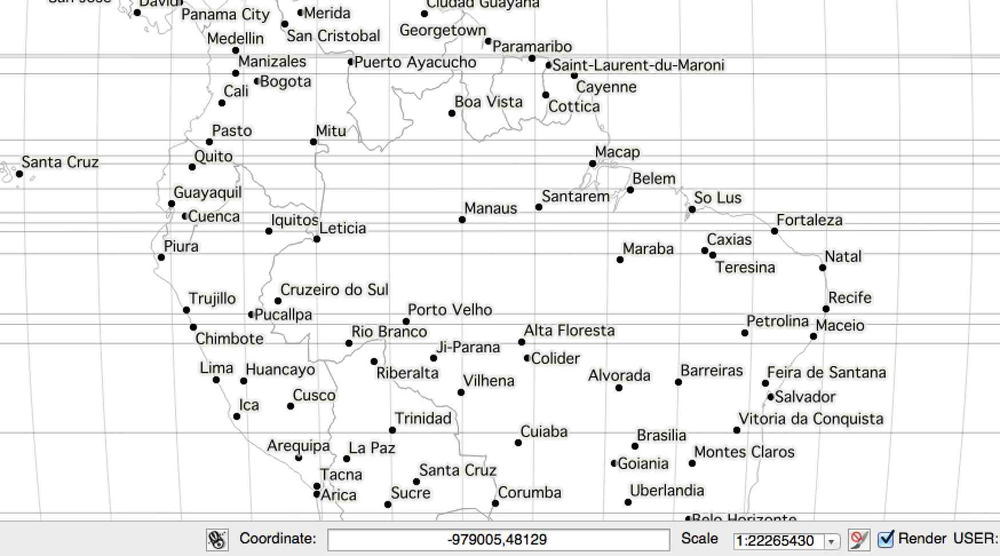
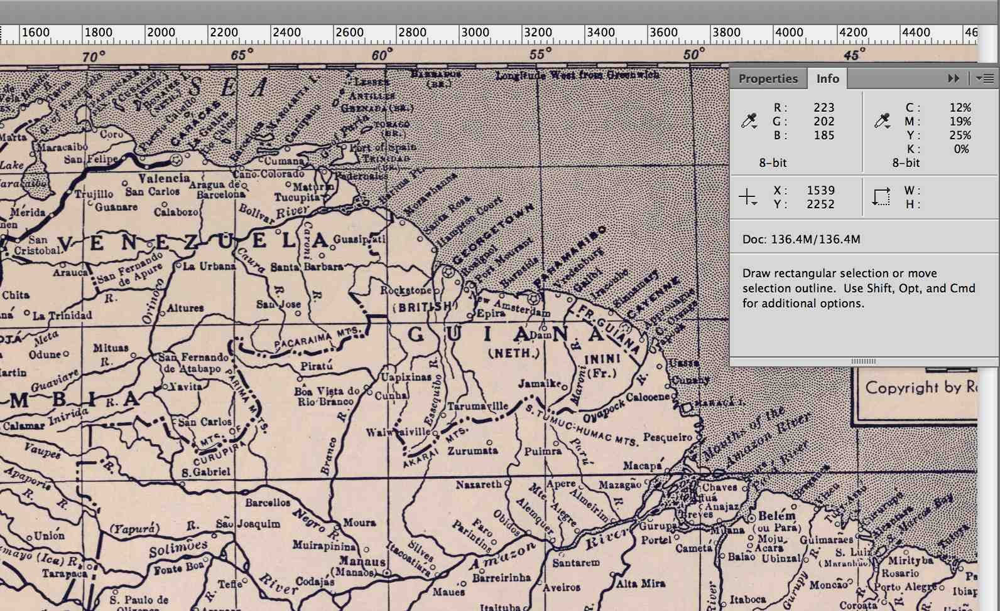
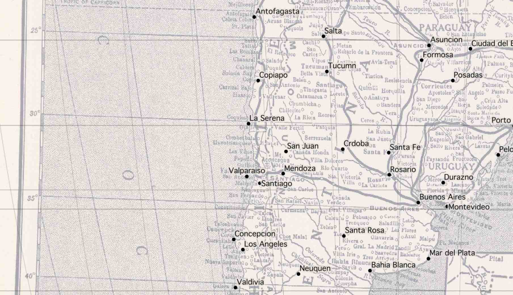
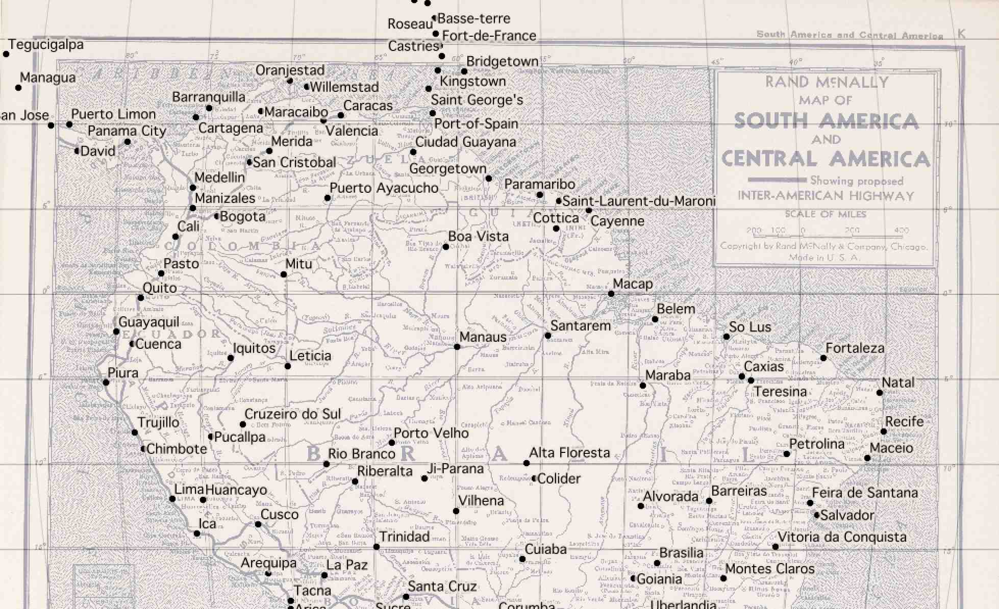

Start by downloading a high-res copy of the
[Rand McNally 1940 map](http://rumsey.georeferencer.com/map/KBMKREinftMNFVlcobKoSC/201507272126-7g9Mkm/).
Follow the image link [to the detail view](http://www.davidrumsey.com/luna/servlet/view/search?q=List_No=5969.08&showFirstDetail=1):

Vector Data and QGIS
--------------------

This downloads a file called [5969008.jpg](5969008.jpg).

Download [vector data from Natural Earth](http://www.naturalearthdata.com/downloads/),
selecting a few layers that match the content of the 1940 map:

* [1:50m populated places](http://www.naturalearthdata.com/http//www.naturalearthdata.com/download/50m/cultural/ne_50m_populated_places.zip)
* [1:50m country borders](http://www.naturalearthdata.com/http//www.naturalearthdata.com/download/50m/cultural/ne_50m_admin_0_countries.zip)
* [1:50m 5° graticules](http://www.naturalearthdata.com/http//www.naturalearthdata.com/download/50m/physical/ne_50m_graticules_5.zip)

The projection of the 1940 map looks a bit like [Mollweide](https://en.wikipedia.org/wiki/Mollweide_projection)
centered on 59°W, so we start by reprojecting the vector data into the
[right PROJ.4 projection string](http://www.remotesensing.org/geotiff/proj_list/mollweide.html):

    ogr2ogr -t_srs '+proj=moll +lon_0=-59' ne_50m_admin_0_countries-moll.shp ne_50m_admin_0_countries.shp
    ogr2ogr -t_srs '+proj=moll +lon_0=-59' ne_50m_populated_places-moll.shp ne_50m_populated_places.shp
    ogr2ogr -t_srs '+proj=moll +lon_0=-59' ne_50m_graticules_5-moll.shp ne_50m_graticules_5.shp

In [QGIS](http://www.qgis.org/), the location can be read from the coordinates display:

Warping The Map
---------------

Back in the 1940 map, corresponding pixel coordinates can be read from
Adobe Photoshop’s info panel:

Using [GDAL](http://www.gdal.org), define a series of ground control points
([GCP](http://landsat.usgs.gov/ground_control_points.php)) centered on cities
in the Natural Earth data and the 1940 map. Use `gdal_translate` to describe
the downloaded map and then `gdalwarp` to bend it into shape:

    gdal_translate -a_srs '+proj=moll +lon_0=-59' \
        -gcp 1233 1249 -1655000 775000 \
        -gcp 4893 2183 2040000 -459000 \
        -gcp 2925 5242 52000 -4176000 \
        -gcp 1170 3053 -1788000 -1483000 \
        -gcp 2256 6916 -767000 -6044000 \
        -of VRT 5969008.jpg 5969008-moll.vrt
    
    gdalwarp -co COMPRESS=JPEG -co JPEG_QUALITY=50 \
        -tps -r cubic 5969008-moll.vrt 5969008-moll.tif

Opening the result in QGIS and comparing it to the 5° graticules shows that the
Mollweide guess was probably wrong:

The exactly horizontal lines of latitude in the original map suggest a pseudocylindrical projection,
and a look at [a list of examples](https://en.wikipedia.org/wiki/List_of_map_projections#pseudocylindrical)
shows that [Sinusoidal](https://en.wikipedia.org/wiki/Sinusoidal_projection) might be better.
Try it all again with [a different PROJ.4 string](http://www.remotesensing.org/geotiff/proj_list/sinusoidal.html):

    ogr2ogr -t_srs '+proj=sinu +lon_0=-59' ne_50m_admin_0_countries-sinu.shp ne_50m_admin_0_countries.shp
    ogr2ogr -t_srs '+proj=sinu +lon_0=-59' ne_50m_populated_places-sinu.shp ne_50m_populated_places.shp
    ogr2ogr -t_srs '+proj=sinu +lon_0=-59' ne_50m_graticules_5-sinu.shp ne_50m_graticules_5.shp

The pixel coordinates will be identical, but the locations will be slightly
different and must be read from QGIS again:

    gdal_translate -a_srs '+proj=sinu +lon_0=-59' \
        -gcp 1233 1249 -1838000 696000 \
        -gcp 4893 2183 2266000 -414000 \
        -gcp 2925 5242 52000 -3826000 \
        -gcp 1170 3053 -1970000 -1329000 \
        -gcp 2256 6916 -711000 -5719000 \
        -of VRT 5969008.jpg 5969008-sinu.vrt
    
    gdalwarp -co COMPRESS=JPEG -co JPEG_QUALITY=50 \
        -tps -r cubic 5969008-sinu.vrt 5969008-sinu.tif

The results looks pretty good:

Cutting Tiles
-------------

For web map display, convert the warped map to map tiles using `gdal2tiles.py`
starting at map zoom level 6:

    gdal2tiles.py -w openlayers -z 0-6 \
        -c 'Rand McNally 1940' -t 'Map of South and Central America' \
        5969008-sinu.tif tiles

Convert all generated PNG tiles to smaller JPEG images using Python and
[convert](http://www.imagemagick.org/script/convert.php):

    python convert-tiles.py
