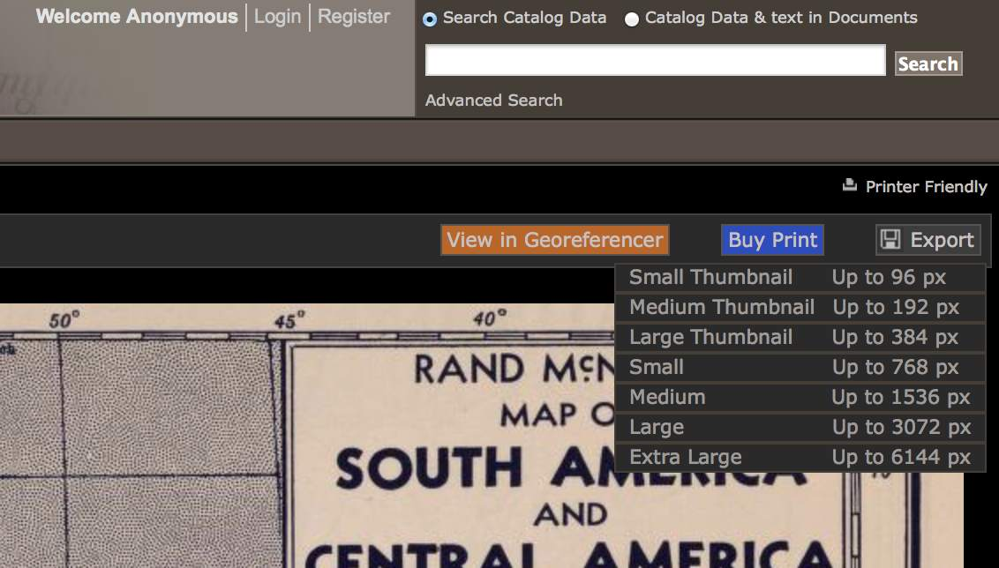

Start by downloading a high-res copy of the
[Rand McNally 1940 map](http://rumsey.georeferencer.com/map/KBMKREinftMNFVlcobKoSC/201507272126-7g9Mkm/).
Follow the image link [to the detail view](http://www.davidrumsey.com/luna/servlet/view/search?q=List_No=5969.08&showFirstDetail=1):

